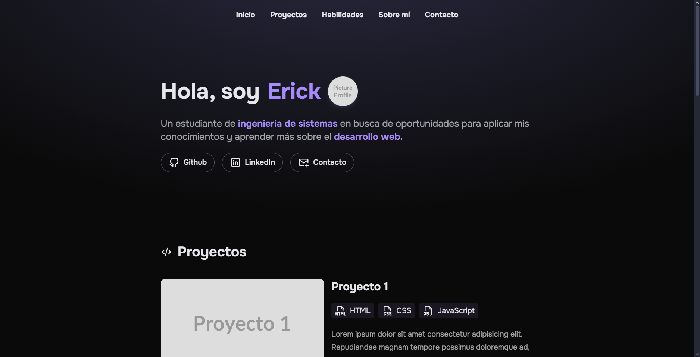
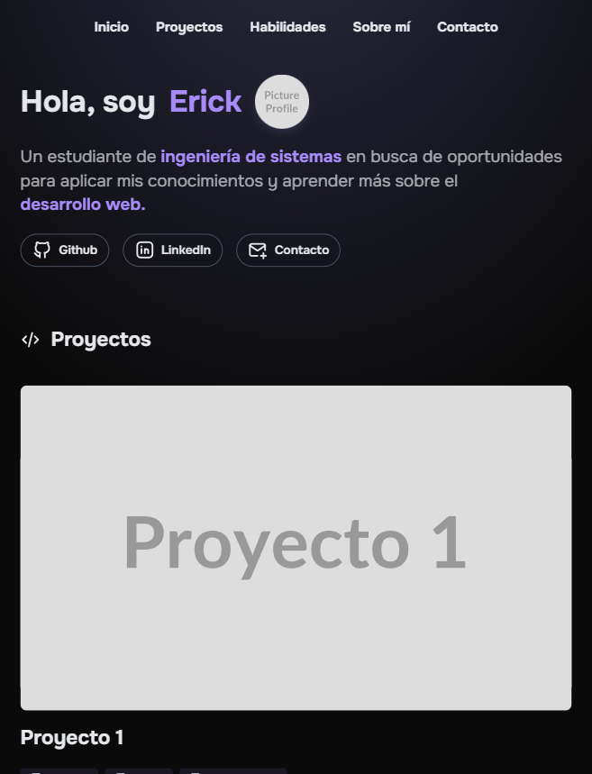

# 📄 Página Personal Simple

Una página personal moderna y responsiva desarrollada con HTML y CSS puro. Este es el **Proyecto #1** de mi serie de proyectos de desarrollo web.

## 📋 Descripción

Página personal que presenta información sobre mí, mis proyectos, habilidades y forma de contacto. Diseñada con un enfoque moderno, utilizando un esquema de colores oscuro y efectos visuales atractivos.

## ✨ Características Implementadas

- **Header con navegación sticky:** Navegación fija con efecto blur al hacer scroll
- **Sección de presentación:** Introducción personal con foto de perfil y saludo
- **Enlaces sociales:** Acceso directo a GitHub, LinkedIn y correo electrónico
- **Sección de proyectos:** Galería de proyectos con tecnologías utilizadas
- **Sección de habilidades:** Grid de tecnologías con iconos SVG y nivel de conocimiento
- **Sección "Sobre mí":** Información personal y académica detallada
- **Pie de página:** Copyright y créditos de recursos utilizados
- **Diseño responsivo completo:** Adaptado para móviles, tablets y desktop
- **Efectos visuales modernos:** Animaciones CSS, efectos hover y degradados
- **Tipografía Google Fonts:** Fuente Onest para una apariencia moderna
- **Iconos SVG escalables:** Iconos de Tabler Icons

## 🛠️ Tecnologías Utilizadas

- **HTML5:** Estructura semántica moderna
- **CSS3:** Estilos avanzados con:
  - Flexbox y CSS Grid para layouts responsivos
  - Custom Properties (variables CSS)
  - Animaciones y transiciones suaves
  - Media queries para responsividad
  - Efectos backdrop-filter y box-shadow
  - Scroll behavior smooth
- **Google Fonts:** Tipografía Onest (100-900 weights)
- **Tabler Icons:** Iconos SVG escalables

## 🎨 Diseño y Estilo

### Paleta de Colores

```css
/* Tema oscuro moderno */
--bg-primary: #0a0a0a; /* Fondo principal */
--text-primary: #e5e7eb; /* Texto principal */
--text-secondary: #e5e7ebb2; /* Texto secundario */
--accent: #a78bfa; /* Color de acento púrpura */
--border: #4b5563; /* Bordes */
--card-bg: rgba(167, 139, 250, 0.05); /* Fondo de tarjetas */
```

### Efectos Especiales

- **Fondo degradado radial** con efecto elíptico
- **Header blur progresivo** activado por scroll
- **Animaciones hover** en elementos interactivos
- **Transformaciones suaves** con scale y translateY
- **Sombras dinámicas** con colores temáticos

## 📱 Responsividad

### Breakpoints

- **Desktop (1024px+):** Layout completo horizontal
- **Tablet (768px-1023px):** Ajustes de espaciado y tamaños
- **Mobile (hasta 767px):**
  - Navegación optimizada
  - Proyectos en columna única
  - Sección "Sobre mí" reorganizada verticalmente
  - Textos y botones redimensionados

## 📂 Estructura del Proyecto

```
01-pagina-personal-simple/
├── index.html              # Página principal
├── styles.css              # Estilos CSS
├── screenshots/            # Capturas de pantalla
│   ├── desktop-view.png    # Vista desktop
│   └── mobile-view.png     # Vista mobile
└── README.md              # Documentación
```

## 🚀 Instalación y Uso

### Clonar el repositorio

```bash
git clone https://github.com/Zero-Fhx/01-pagina-personal-simple.git
cd 01-pagina-personal-simple
```

### Ejecutar el proyecto

1. **Método simple:** Abre `index.html` directamente en tu navegador
2. **Con Live Server (recomendado):**
   - Instala Live Server en VS Code
   - Click derecho en `index.html` → "Open with Live Server"
3. **Servidor local:**

   ```bash
   # Con Python 3
   python -m http.server 8000

   # Con Node.js (http-server)
   npx http-server
   ```

## ✅ Requisitos Cumplidos

Este proyecto incluye todas las características esenciales de una página personal:

- [x] Header con nombre, foto y breve bio
- [x] Sección "Sobre mí" completa
- [x] Sección de intereses o habilidades (skills)
- [x] Enlaces a GitHub, LinkedIn y correo
- [x] Pie de página con año actual
- [x] Diseño responsivo básico (y avanzado)
- [x] Fuente de Google Fonts (Onest)
- [x] Íconos SVG (Tabler Icons)

## 🌐 Demo en Vivo

🔗 **[Ver Demo](https://zero-fhx.github.io/01-pagina-personal-simple/)** (GitHub Pages)

## 📸 Capturas de Pantalla

### Vista Desktop



### Vista Mobile



## 🔧 Características Técnicas Destacadas

### Animación del Header

```css
.header {
  animation: blur linear both;
  animation-timeline: scroll();
  animation-range: 0 500px;
}
```

### Grid Responsivo de Habilidades

```css
.skills-list {
  display: grid;
  grid-template-columns: repeat(auto-fit, minmax(220px, 1fr));
  gap: 1.5rem;
}
```

### Efectos Hover Modernos

```css
.skill-card:hover {
  transform: translateY(-4px);
  box-shadow: 0 8px 16px rgba(167, 139, 250, 0.15);
}
```

## 🔮 Futuras Mejoras

- [ ] **Toggle modo claro/oscuro** con persistencia localStorage
- [ ] **Animaciones de scroll reveal** con Intersection Observer
- [ ] **Formulario de contacto** funcional con validación
- [ ] **Galería de certificaciones** expandible
- [ ] **Timeline de experiencia** interactiva
- [ ] **Blog integrado** con posts estáticos
- [ ] **Optimización de imágenes** con lazy loading
- [ ] **PWA features** (Service Worker, manifest)

## 📝 Lecciones Aprendidas

### Técnicas CSS Avanzadas

- Implementación de **scroll-driven animations**
- Uso efectivo de **CSS Grid** para layouts complejos
- Manejo de **pseudo-elementos** para efectos visuales
- **Media queries** con enfoque mobile-first

### Mejores Prácticas

- Estructura semántica HTML5
- Accesibilidad con atributos ARIA
- Optimización de rendimiento CSS
- Organización modular de estilos

### Diseño Responsivo

- Breakpoints estratégicos
- Flexibilidad en componentes
- Tipografía escalable
- Imágenes adaptativas

## 🤝 Contribuciones

Este es un proyecto personal de aprendizaje, pero si encuentras mejoras o tienes sugerencias:

1. Fork el repositorio
2. Crea una rama para tu feature (`git checkout -b feature/mejora`)
3. Commit tus cambios (`git commit -m 'Añadir mejora'`)
4. Push a la rama (`git push origin feature/mejora`)
5. Abre un Pull Request

## 👨‍💻 Autor

**Erick Obed Flores Ricra**

- 🐙 GitHub: [@Zero-Fhx](https://github.com/Zero-Fhx)
- 💼 LinkedIn: [Erick Obed Flores Ricra](https://www.linkedin.com/in/erick-obed-flores-ricra-14a121280)
- 📧 Email: erickflores170404@gmail.com

---

**🤖 Desarrollo Asistido por IA:** Este proyecto fue desarrollado con la asistencia de inteligencia artificial para la búsqueda de información, resolución de problemas técnicos, optimización de código, consulta de conceptos desconocidos y creación de esta documentación.
